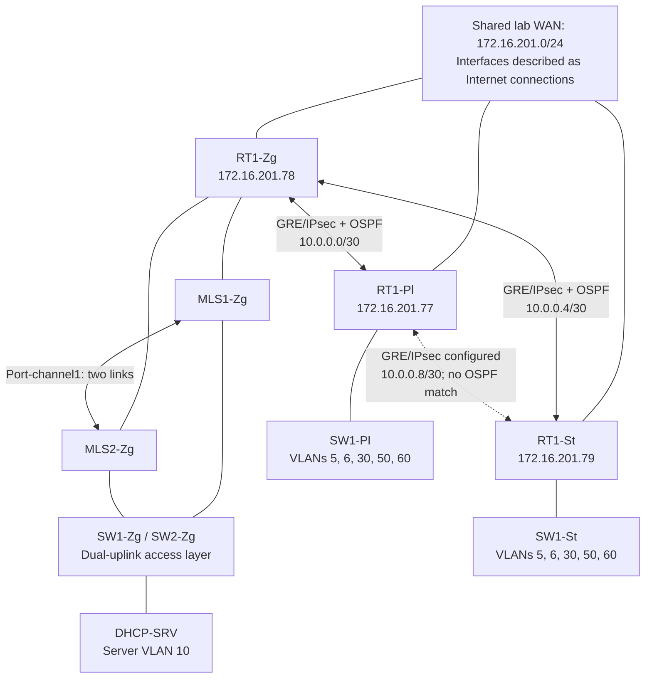

# Multi-Site Enterprise Network Infrastructure — CCNA Capstone

A Cisco networking laboratory spanning **Zagreb, Pula, and Split**, developed as one evolving infrastructure across CCNA ITN, SRWE, and ENSA. The project combines subnet planning, redundant campus gateways, branch routing, protected inter-site tunnels, network services, and Ansible operations.

This portfolio reconstructs the final configuration from **36 local running-configuration exports for 10 devices**, dated 12 February 2026. Configuration presence is distinguished from operational validation throughout the [evidence matrix](docs/12-evidence-matrix.md).

## Architecture at a glance

- **Zagreb:** two multilayer switches provide VLAN routing and HSRP gateways, with a two-link EtherChannel and two access switches.
- **Pula and Split:** a router and access switch at each site provide 802.1Q branch segmentation.
- **Inter-site:** three GRE tunnel pairs with IPsec crypto maps; OSPF process 100, area 0, is configured on the Zagreb–branch paths and Zagreb routed core links.
- **Services:** Zagreb DHCP router, branch DHCP pools, NTP, and SNMP/syslog references to a monitoring endpoint.



Links represent configured logical relationships, not captured neighbor or tunnel status. The lab WAN is private addressing; upstream Internet reachability is not demonstrated. Zagreb access uplink pairing is inferred from trunk configurations and descriptions. See [architecture](docs/02-final-architecture.md) for the evidence boundaries.

## Technologies and engineering highlights

| Engineering area | Configuration evidence |
|---|---|
| Segmentation | IPv4 subnetting, IPv6 LAN addressing, SVIs, 802.1Q trunks, management and wireless/guest VLAN references |
| Campus redundancy | HSRPv2 IPv4/IPv6 groups, aligned HSRP preferences and STP priorities, static EtherChannel |
| Routing and edge | OSPF 100/area 0 on five devices, GRE-over-IPsec configuration, PAT on three routers, TCP port forwarding at Zagreb |
| Access protection | Port-security, PortFast, BPDU Guard, DHCP snooping; DAI on Zagreb access switches and Split VLAN 30 |
| Operations | SSH configuration, NTP hierarchy, SNMP read-only communities, syslog destinations, Ansible backup and save workflows |

**Important final-state findings:** the Pula–Split tunnel is not selected by OSPF; access switches use PVST rather than Rapid PVST; WAN interfaces use static addresses; and the management ACL automation is not reflected in the latest exports. Wireless controller/AP settings, telephony registration, guest isolation, and VoIP Internet restrictions are not evidenced. These observations are documented rather than corrected.

## Automation and validation

[Ansible automation](docs/09-ansible-automation.md) targets ten Cisco devices using `network_cli`: running-config backups, critical-target and inventory-wide pings, configuration saves, monitoring configuration, and management ACL configuration.

The timestamped exports provide historical **configuration evidence**. A lab photograph also records an Ansible recap with no reported failures or unreachable hosts; its invocation is not shown. Ping playbooks exist, but no retained ping results, OSPF neighbor output, IPsec SA output, or failover measurements were found. No live testing was performed for this documentation. [Validation and testing](docs/10-validation-and-testing.md) explains the available evidence and useful follow-up captures.

## Repository structure

```text
.
├── README.md                 # Portfolio overview
├── docs/                     # Architecture, analysis, and evidence matrix
├── images/                   # Lab photographs and reference topology drawing
├── ansible.cfg
├── inventory
├── group_vars/all.yml
├── ssh-config
└── playbooks/
    ├── backup.yml
    ├── test-conn.yml
    ├── full-conn.yml
    ├── save.yml
    ├── config-monitor.yml
    ├── acl.yml
    └── backups/              # Local timestamped device exports
```

**Evidence availability:** existing `.gitignore` rules exclude `backups/` and `*.txt`; the analyzed backups are local, untracked evidence and may not accompany a GitHub clone. `acl.yml`, `save.yml` and the images were also untracked when analyzed. Paths are preserved; the [snapshot catalog](docs/12-evidence-matrix.md#snapshot-catalog) identifies every local export and the selected final state. [Supporting images](docs/12-evidence-matrix.md#supporting-images) document the lab context separately from final configuration.

## Detailed documentation

| Foundations and architecture | Implementation and operations |
|---|---|
| [01 — Project evolution](docs/01-project-evolution.md) | [07 — Network security](docs/07-network-security.md) |
| [02 — Final architecture](docs/02-final-architecture.md) | [08 — Services and monitoring](docs/08-network-services-and-monitoring.md) |
| [03 — Addressing and segmentation](docs/03-addressing-and-segmentation.md) | [09 — Ansible automation](docs/09-ansible-automation.md) |
| [04 — Switching and redundancy](docs/04-switching-and-redundancy.md) | [10 — Validation and testing](docs/10-validation-and-testing.md) |
| [05 — Routing, VPN, and NAT](docs/05-routing-vpn-and-nat.md) | [11 — Production Considerations](docs/11-production-considerations.md) |
| [06 — Wireless infrastructure](docs/06-wireless-infrastructure.md) | [12 — Evidence matrix](docs/12-evidence-matrix.md) |

## Engineering outcomes

The project demonstrates how a foundational multi-site network can evolve into a segmented campus/branch infrastructure with automation. Aligning gateway preferences with STP priorities makes forwarding intent explicit; correlating tunnel endpoints, route selectors, DHCP gateways, and inventory addresses exposes configuration drift. A central lesson is that a configuration export, a test procedure, and a successful runtime result establish different levels of evidence.

Some choices reflect CCNA lab equipment and requirements. [Production Considerations](docs/11-production-considerations.md) describes modern equivalents without presenting them as implemented features.
