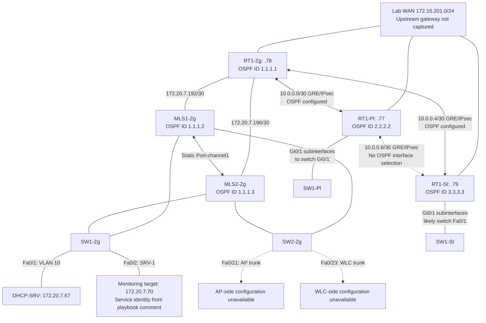
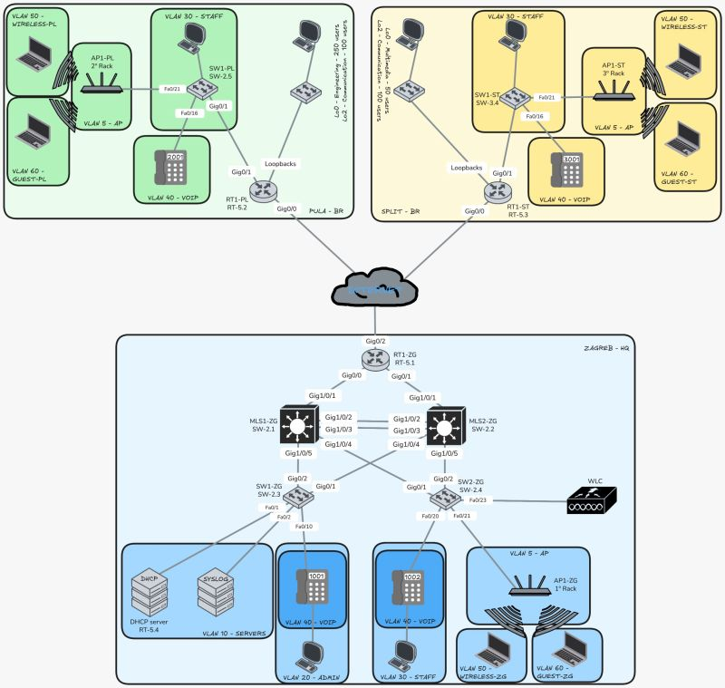

# 02 — Final architecture

[Portfolio overview](../README.md) · [Source index](12-evidence-matrix.md#primary-final-state-sources)

## Reconstructed roles

| Site | Devices | Final configuration role |
|---|---|---|
| Zagreb | RT1-Zg | WAN edge, two core transit links, GRE/IPsec, OSPF, PAT/port forwarding and NTP reference |
| Zagreb | MLS1-Zg, MLS2-Zg | IPv4/IPv6 VLAN gateways, HSRP, STP priority distribution, static inter-core EtherChannel, OSPF core routing |
| Zagreb | SW1-Zg, SW2-Zg | Access switching, dual configured core-facing trunks, server/phone and wireless infrastructure ports |
| Zagreb | DHCP-SRV | Cisco router serving Zagreb DHCPv4 pools; DHCPv6 pool definitions; server VLAN interface |
| Pula | RT1-Pl, SW1-Pl | Router-on-a-stick LAN, local DHCP, WAN edge, GRE/IPsec and OSPF to Zagreb |
| Split | RT1-St, SW1-St | Router-on-a-stick LAN, local DHCP, WAN edge, GRE/IPsec and OSPF to Zagreb |

Hardware evidence includes a Cisco 2911 at RT1-Zg, 2851s at RT1-Pl/RT1-St, a 2821 at DHCP-SRV, and `ws-c3650-24ps` provisioning on the multilayer switches. The exports do not identify every access-switch model. WLC/AP aliases and attachment ports exist, but there are no backups for those devices.

## Logical topology

**Diagram interpretation:** routed transit endpoints and GRE peer pairs are corroborated at both ends. Zagreb access links show the inferred dual-core design: both access switches have two compatible trunks and both cores have two access-facing trunks, but descriptions do not resolve exact port pairing. Split's likely router attachment is inferred from its only explicitly configured infrastructure trunk. The monitoring target is consistently referenced; no server interface export proves that `SRV-1` is the `.70` endpoint. Dashed wireless attachments identify incomplete evidence rather than confirmed operational neighbors.

## Cross-device reconstruction

| Relationship | Configuration correlation | Limit |
|---|---|---|
| Zagreb edge to MLS1 | RT1-Zg Gi0/0 `.193/30`; MLS1 Gi1/0/1 `.194/30`; reciprocal descriptions | No neighbor or link-state capture |
| Zagreb edge to MLS2 | RT1-Zg Gi0/1 `.197/30`; MLS2 Gi1/0/1 `.198/30`; reciprocal descriptions | No neighbor or link-state capture |
| Core EtherChannel | Both cores Gi1/0/2–3 use group 1 `mode on`, matching native/allowed VLANs | No bundle-state output; not LACP |
| Zagreb access trunks | Native VLAN 7 and allowed `5-7,10,20,30,40,50,60` match core trunks | Exact uplink mapping unconfirmed |
| Branch tagged VLANs | Router tags 5, 6, 30, 50, 60 match switch trunk allowances | Switch native VLAN 7 is excluded from branch allowed lists; no router native subinterface |
| Server default gateway | DHCP-SRV `.67/26` defaults to `.126`; both MLS VLAN 10 HSRP VIPs are `.126` | HSRP state not captured |

Detailed addressing is in [03](03-addressing-and-segmentation.md), redundancy in [04](04-switching-and-redundancy.md), routing in [05](05-routing-vpn-and-nat.md), and the complete manual-review register in [10](10-validation-and-testing.md#manual-review-register).

## Reference topology drawing

The drawing supports the dual-core access design and identifies SW1-Zg's server attachments and SW2-Zg's AP/WLC ports. It depicts MLS1 Gi1/0/5 → SW1 Gi0/2, MLS1 Gi1/0/4 → SW2 Gi0/1, MLS2 Gi1/0/4 → SW1 Gi0/1, and MLS2 Gi1/0/5 → SW2 Gi0/2. These are **drawing-based mappings**, not neighbor-discovery evidence; the generic final-config descriptions alone do not resolve them.

The drawing also shows branch phones on Fa0/16. Both final branch switch exports shut down that port in VLAN 99, and neither branch router has a VLAN 40 subinterface. Thus the drawing cannot override the latest exports or establish final branch telephony. Its WAN cloud likewise supplies no upstream gateway or reachability result.
