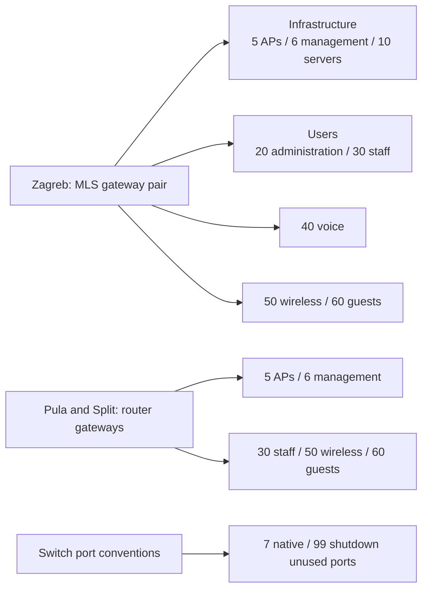

# 03 — Addressing and segmentation

[Portfolio overview](../README.md) · [Source index](12-evidence-matrix.md#primary-final-state-sources)

VLAN purpose labels below follow the supplied SRWE scheme. Final exports evidence VLAN use through SVIs, access assignments, voice assignments and trunk lists; they do **not** contain an explicit VLAN database/name listing. Do not infer that all lab VLAN names or operational VLAN states were captured.

## Zagreb routed VLANs

Derived from the final [MLS1](../playbooks/backups/MLS1-Zg_2026-02-12_20-20-51.txt) and [MLS2](../playbooks/backups/MLS2-Zg_2026-02-12_20-20-51.txt) SVI blocks. All listed IPv6 prefixes are `/64`.

| VLAN / intended purpose | IPv4 subnet | MLS1 address | MLS2 address | HSRP IPv4 VIP | IPv6 prefix |
|---|---|---|---|---|---|
| 5 / APs | 172.20.7.128/26 | 172.20.7.129 | 172.20.7.130 | 172.20.7.189 | 2001:A:0:7::/64 |
| 6 / management | 172.20.7.0/26 | 172.20.7.5 | 172.20.7.6 | 172.20.7.62 | 2001:A:0:5::/64 |
| 10 / servers | 172.20.7.64/26 | 172.20.7.65 | 172.20.7.66 | 172.20.7.126 | 2001:A:0:6::/64 |
| 20 / administration | 172.20.5.0/24 | 172.20.5.1 | 172.20.5.2 | 172.20.5.254 | 2001:A:0:2::/64 |
| 30 / staff | 172.20.4.0/24 | 172.20.4.1 | 172.20.4.2 | 172.20.4.254 | 2001:A:0:3::/64 |
| 40 / voice | 172.20.0.0/23 | 172.20.0.1 | 172.20.0.2 | 172.20.1.254 | 2001:A::/64 |
| 50 / wireless | 172.20.2.0/23 | 172.20.2.1 | 172.20.2.2 | 172.20.3.254 | 2001:A:0:1::/64 |
| 60 / guests | 172.20.6.0/24 | 172.20.6.1 | 172.20.6.2 | 172.20.6.254 | 2001:A:0:4::/64 |

IPv6 SVI host portions are `::1`/`::2` except management VLAN 6 (`::4`/`::5`). Each SVI has a configured IPv6 link-local address and an HSRP IPv6 autoconfiguration group. No global IPv6 virtual gateway address is exported; do not substitute a guessed global VIP.

## Branch router-on-a-stick networks

From [RT1-Pl](../playbooks/backups/RT1-Pl_2026-02-12_20-20-50.txt) and [RT1-St](../playbooks/backups/RT1-St_2026-02-12_20-20-50.txt), interface `Gi0/1.<VLAN>`.

| Site | VLAN | IPv4 subnet | Router gateway | IPv6 gateway |
|---|---|---|---|---|
| Pula | 5 | 172.20.11.96/28 | 172.20.11.97 | 2001:B:0:6::1/64 |
| Pula | 6 | 172.20.11.112/28 | 172.20.11.113 | 2001:B:0:7::1/64 |
| Pula | 30 | 172.20.10.128/25 | 172.20.10.129 | 2001:B:0:3::1/64 |
| Pula | 50 | 172.20.9.0/24 | 172.20.9.1 | 2001:B:0:1::1/64 |
| Pula | 60 | 172.20.11.0/26 | 172.20.11.1 | 2001:B:0:4::1/64 |
| Split | 5 | 172.20.13.224/28 | 172.20.13.225 | 2001:C:0:6::1/64 |
| Split | 6 | 172.20.13.240/28 | 172.20.13.241 | 2001:C:0:7::1/64 |
| Split | 30 | 172.20.12.0/25 | 172.20.12.1 | 2001:C::1/64 |
| Split | 50 | 172.20.12.128/25 | 172.20.12.129 | 2001:C:0:1::1/64 |
| Split | 60 | 172.20.13.192/27 | 172.20.13.193 | 2001:C:0:5::1/64 |

Branches do not contain configured VLAN 20 or VLAN 40 router subinterfaces in the final exports. Therefore the project's administration and voice VLAN scheme cannot be generalized to every site.

## Other addressing

| Function | Network / endpoints |
|---|---|
| RT1-Zg ↔ MLS1 | 172.20.7.192/30: router `.193`, MLS `.194` |
| RT1-Zg ↔ MLS2 | 172.20.7.196/30: router `.197`, MLS `.198` |
| WAN underlay | 172.16.201.0/24: Pula `.77`, Zagreb `.78`, Split `.79`; static addresses |
| GRE Zagreb ↔ Pula | 10.0.0.0/30: Zagreb `.1`, Pula `.2` |
| GRE Zagreb ↔ Split | 10.0.0.4/30: Zagreb `.5`, Split `.6` |
| GRE Pula ↔ Split | 10.0.0.8/30: Pula `.9`, Split `.10` |
| Switch management | SW1-Zg 172.20.7.8/26; SW2-Zg 172.20.7.9/26; SW1-Pl 172.20.11.114/28; SW1-St 172.20.13.242/28 |
| DHCP router | 172.20.7.67/26; IPv6 2001:A:0:6::3/64 |
| Monitoring reference | 172.20.7.70; endpoint interface configuration not captured |

VLAN 7 is the intended infrastructure native VLAN. VLAN 99 is used for shutdown unused-port assignments and shutdown unaddressed core SVIs. Neither has a final routed subnet.

### Administratively shutdown lab networks

| Device/interface | IPv4 address/subnet | IPv6 address | Description |
|---|---|---|---|
| RT1-Pl Lo0 | 172.20.8.254/24 | 2001:B::1/64 | Engineering |
| RT1-Pl Lo1 | 172.20.11.94/27 | 2001:B:0:5::1/64 | Design |
| RT1-Pl Lo2 | 172.20.10.126/25 | 2001:B:0:2::1/64 | Communication |
| RT1-St Lo0 | 172.20.13.62/26 | 2001:C:0:2::1/64 | Multimedia |
| RT1-St Lo1 | 172.20.13.126/26 | 2001:C:0:3::1/64 | Design |
| RT1-St Lo2 | 172.20.13.190/26 | 2001:C:0:4::1/64 | Communication |

All six have explicit `shutdown`. Some are selected by OSPF statements, but that does not make them active networks.

## Segmentation overview

VLAN separation creates distinct broadcast domains; it does not establish guest isolation or Internet restrictions without enforced routing policy. No such data-plane ACL application is present in the latest exports.

**Naming drift:** many `ip host` entries retain old Zagreb addresses; other devices map RT1-St to the guest gateway `.193` rather than inventory management `.241`. Inventory and interface addresses are preferred over these aliases. See the [review register](10-validation-and-testing.md#manual-review-register).
