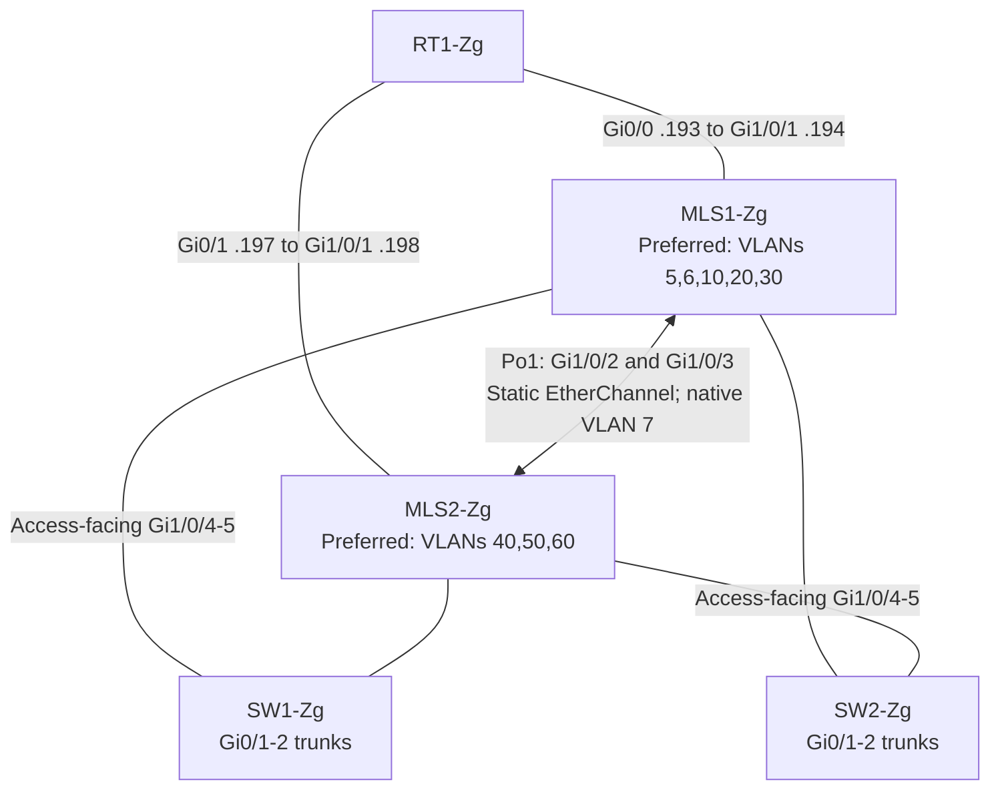

# 04 — Switching and redundancy

[Portfolio overview](../README.md) · [Source index](12-evidence-matrix.md#primary-final-state-sources)

## Zagreb core and access design



The diagram expresses the inferred dual-uplink access architecture, not confirmed cable/port mapping. Core uplink descriptions say `connection to SW1-2`; access descriptions are generic or absent.

## EtherChannel and trunk compatibility

Both [MLS1](../playbooks/backups/MLS1-Zg_2026-02-12_20-20-51.txt) and [MLS2](../playbooks/backups/MLS2-Zg_2026-02-12_20-20-51.txt) configure:

```text
interface Port-channel1
 switchport trunk native vlan 7
 switchport trunk allowed vlan 5-7,10,20,30,40,50,60
 switchport mode trunk
 switchport nonegotiate
```

Members `Gi1/0/2` and `Gi1/0/3` carry identical trunk settings and `channel-group 1 mode on`. This is **static EtherChannel**, not LACP or PAgP. Matching member configuration supports the intended bundle, but operational membership and forwarding require `show etherchannel summary` evidence.

Core access-facing ports and Zagreb access-switch uplinks share the same native VLAN and allowed list. VLAN 99 is deliberately absent from these trunk lists. Branch infrastructure trunks allow `5,6,30,50,60`, with native VLAN 7 configured but not allowed; routers have only tagged subinterfaces for those five VLANs. Untagged/native handling needs review, rather than assuming a routed native VLAN exists.

## HSRP and STP alignment

| VLANs | MLS1 HSRP priority | MLS2 HSRP priority | MLS1 STP priority | MLS2 STP priority | Configured preference |
|---|---|---|---|---|---|
| 5, 6, 10, 20, 30 | 110 | 90 | 4096 | 8192 | MLS1 |
| 40, 50, 60 | 90 | 110 | 8192 | 4096 | MLS2 |

Both cores use HSRP version 2 and preemption. IPv4 VIPs agree on all eight SVIs and match the [addressing table](03-addressing-and-segmentation.md). The IPv4/IPv6 group pairs are VLAN 5: `5/4`; VLAN 6: `6/7`; VLAN 10: `10/11`; VLAN 20: `20/21`; VLAN 30: `30/31`; VLAN 40: `40/41`; VLAN 50: `50/51`; VLAN 60: `60/61`.

The corresponding IPv6 groups use `ipv6 autoconfig`, matching priorities and preemption at both ends. Gateway and preferred root alignment reduces unnecessary inter-core forwarding under the intended topology. Configured priorities establish preference, not actual HSRP active or elected STP root state. No interface tracking is visible in HSRP blocks, so upstream failure response must not be assumed.

## STP scope

- The two multilayer switches use `spanning-tree mode rapid-pvst`.
- **All four access switches use `spanning-tree mode pvst`.** The repository does not support an end-to-end Rapid PVST claim; interaction at these boundaries and failover timing require runtime evidence.
- VLAN 7 and VLAN 99 are not included in the explicit core priority distribution.
- PortFast and BPDU Guard are configured on many access ports to accelerate host activation and reject unexpected bridge BPDUs. They are not a substitute for confirming actual root/port roles.

Unused ports are commonly assigned to VLAN 99 and shut down. Some unused user/server-range ports remain assigned to their functional VLANs with `shutdown`. MLS `Gi1/1/1-4` and Split `Gi0/1-2` have empty blocks, so the stronger claim “every unused port is disabled” is not supported.

Access protection details are in [07 — Network security](07-network-security.md); suggested state/failover captures are in [10 — Validation](10-validation-and-testing.md).
