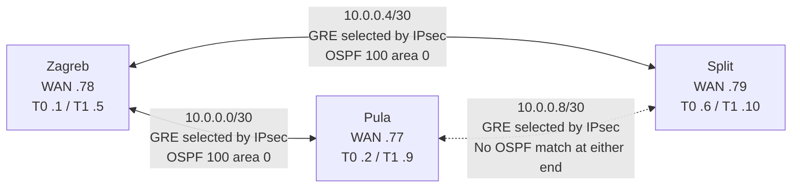

# 05 — Routing, VPN, and NAT

[Portfolio overview](../README.md) · [Source index](12-evidence-matrix.md#primary-final-state-sources)

Sources: final [RT1-Zg](../playbooks/backups/RT1-Zg_2026-02-12_20-20-50.txt), [RT1-Pl](../playbooks/backups/RT1-Pl_2026-02-12_20-20-50.txt), [RT1-St](../playbooks/backups/RT1-St_2026-02-12_20-20-50.txt), and both Zagreb MLS exports.

## Underlay and protected overlay

All three WAN interfaces are statically addressed on `172.16.201.0/24` and described as Internet connections. RT1-Zg uses `Gi0/2`; the branches use `Gi0/0`. An upstream router, DHCP lease, public address or Internet test result is not present.

Each tunnel's destination matches the peer WAN interface; its source is the local WAN interface. Reciprocal crypto peers and GRE selectors match these addresses, and pre-shared-key entries agree by peer pair. Configured compatibility does not prove established SAs.

## IPsec policy

| Component | Exported configuration | Interpretation |
|---|---|---|
| IKE policy | `crypto isakmp policy 100`, `encr aes`, `authentication pre-share`, `group 5` | IKEv1/ISAKMP, AES-128 and DH group 5. IKE hash is not explicitly exported; SHA is the IOS default, not an explicit `hash sha` line. |
| ESP transform | `TSET esp-aes esp-sha-hmac` | AES-128 encryption with SHA-HMAC integrity |
| Encapsulation | Tunnel interfaces without alternate `tunnel mode`; GRE descriptions and ACL selectors | IOS default GRE tunnel behavior; crypto maps select GRE outer traffic |
| Application | `crypto map CROATIA` on each WAN interface | Crypto-map GRE-over-IPsec design, not a tunnel-protection profile |

RT1-Zg explicitly exports `mode tunnel` for TSET; branches omit the mode command (IOS default tunnel mode). `GRE_TO_*` ACLs permit protocol GRE between WAN peers and are referenced by crypto-map `match address`. Their `deny ip any any` entries do **not** provide general WAN firewall enforcement: these are crypto traffic selectors, not interface access groups.

## OSPF reconstruction

| Device | Router ID | Selected interfaces/networks | Passive/default behavior |
|---|---|---|---|
| RT1-Zg | 1.1.1.1 | Tunnel0, Tunnel1, both core transits; broad `172.20.0.0 0.0.7.255` match | No passive-interface declaration; `default-information originate` |
| RT1-Pl | 2.2.2.2 | Tunnel0 and VLAN 5/6/30/50/60 subinterfaces; shutdown Lo1 also matched | Only physical Gi0/1 declared passive |
| RT1-St | 3.3.3.3 | Tunnel0 and VLAN 5/6/30/50/60 subinterfaces; shutdown Lo1 also matched | Only physical Gi0/1 declared passive |
| MLS1-Zg | 1.1.1.2 | Eight routed VLAN subnets and 172.20.7.192/30 | Passive default; only Gi1/0/1 non-passive |
| MLS2-Zg | 1.1.1.3 | Eight routed VLAN subnets and 172.20.7.196/30 | Passive default; only Gi1/0/1 non-passive |

All selected networks use process **100**, area **0**. `network` statements select local interfaces; they are not advertisements of every arbitrary address within a wildcard range. The broad Zagreb match does not create additional LAN interfaces.

**Routing gaps:** neither Pula's `10.0.0.9` nor Split's `10.0.0.10` is matched by OSPF, and Tunnel1 has no interface-level OSPF command. Thus GRE/IPsec is configured as a three-pair overlay, while evidenced OSPF selection is Zagreb-centered. Branch `passive-interface Gi0/1` does not explicitly list the active VLAN subinterfaces; their passive state needs manual confirmation. No OSPFv3 or IPv6 tunnel routing is configured.

## Defaults and retained static routes

- Each site router has an IPv4 default route using only its Ethernet WAN exit interface. No explicit next-hop address is exported; effective forwarding depends on underlay behavior, including possible proxy ARP.
- Only RT1-Zg has `default-information originate`, without `always`; origination depends on an installed default. This is OSPF default origination, not a general `redistribute static` configuration.
- Both MLS devices retain IPv4 default routes with their edge next-hop and IPv6 defaults using the edge link-local next-hop.
- DHCP-SRV defaults to the VLAN 10 HSRP VIP `172.20.7.126`.
- No old explicit static inter-site routes are present in the latest site-router exports. IPv6 end-to-end connectivity across sites is not evidenced despite retained LAN addressing.

## NAT/PAT and port forwarding

All site routers configure `ip nat inside source list 1 interface <WAN> overload`. ACL 1 permits `172.20.0.0/16`; Zagreb marks its two core-facing interfaces inside, while branches mark VLAN 5/6/30/50/60 subinterfaces inside. WAN interfaces are outside. Tunnel interfaces are not marked NAT inside/outside.

RT1-Zg also forwards TCP **80, 443 and 22** from its WAN interface address to **172.20.7.67**, the DHCP router. This is static TCP port translation, not a one-to-one static IP mapping. The DHCP router exports HTTP/HTTPS server configuration and SSH VTY configuration, but no application or external-access test result is retained.

PAT eligibility includes voice and guest subnets wherever they enter an inside interface. It does not enforce the required VoIP Internet prohibition or guest-only-Internet policy. No applied data-plane policy ACL establishes those restrictions. NAT translations, SA counters and OSPF neighbors remain [validation gaps](10-validation-and-testing.md).
