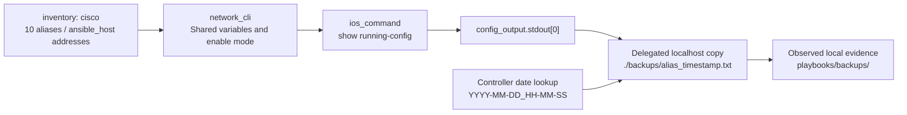

# 09 — Ansible automation

[Portfolio overview](../README.md) · [Evidence matrix](12-evidence-matrix.md)

This analysis is based on code inspection only. No playbook, syntax-check command requiring Ansible, or device connection was executed for the documentation.

## Inventory and connection model

[inventory](../inventory) defines four `routers` (the three site routers plus DHCP-SRV) and six `switches` (four access and two multilayer). Parent group `cisco` includes both. Every playbook targets `cisco` and disables fact gathering. Each `ansible_host` agrees with a final interface address; inventory aliases omit the configured `-222` hostname suffix.

| Group | Inventory alias → connection address |
|---|---|
| routers | RT1-Zg → 172.20.7.193; RT1-Pl → 172.20.11.113; RT1-St → 172.20.13.241; DHCP-SRV → 172.20.7.67 |
| switches | MLS1-Zg → 172.20.7.5; MLS2-Zg → 172.20.7.6; SW1-Zg → 172.20.7.8; SW2-Zg → 172.20.7.9; SW1-Pl → 172.20.11.114; SW1-St → 172.20.13.242 |

[group_vars/all.yml](../group_vars/all.yml) supplies a shared local lab account, password-based access, `network_cli`, `ansible_network_os: ios`, and enable-mode escalation. Credentials are not repeated here. The generic connection/platform names rely on the installed Ansible collection resolution; versions are not pinned in this repository.

[ansible.cfg](../ansible.cfg) selects `./inventory`, disables host-key checking/retry files, sets automatic silent Python selection, and sets 60-second timeouts with Paramiko persistent SSH. All device commands use `cisco.ios.ios_command` or `cisco.ios.ios_config`; local backup tasks use `file`/`copy` delegation.

The group variables reference **`/home/gsargaco/.ssh/config`**, not the repository's [ssh-config](../ssh-config). That sample enables legacy KEX, RSA host-key and CBC cipher compatibility for `172.20.*` hosts and disables host-key persistence/checking. Its installation or effective use by the selected transport is not evidenced. It is a controller-specific portability dependency.

## Playbook-by-playbook behavior

| Playbook | Exact workflow | Writes / retained evidence |
|---|---|---|
| [backup.yml](../playbooks/backup.yml) | Local `file` task creates `./backups/` once; `ios_command` runs `show running-config`; delegated `copy` saves `config_output.stdout[0]` | Local text export; no startup-config, neighbor state, test output or diff report |
| [test-conn.yml](../playbooks/test-conn.yml) | Each device pings 172.20.7.193, 172.20.7.70 and 172.20.7.67; reports whether output contains `Success rate is 100 percent` | Console debug only; no persisted results, assert or failure task for reported packet loss |
| [full-conn.yml](../playbooks/full-conn.yml) | Each device pings every other inventory host's `ansible_host`; skips self; same 100% string criterion | Ten devices imply 90 directed ping invocations per complete run; console-only status, no policy/failover tests |
| [save.yml](../playbooks/save.yml) | `write memory`, registers output and displays it | Writes device NVRAM if run; no retained execution output |
| [config-monitor.yml](../playbooks/config-monitor.yml) | `ios_config` declares read-only SNMP community; syslog `.70`, informational level, logging on | Modifies running config if run; no explicit save, no NTP or LibreNMS installation |
| [acl.yml](../playbooks/acl.yml) | Creates standard ACL_SNMP, removes prior unrestricted community via `before`, binds replacement community; creates ACL_SSH; applies VTY 0–15 access-class; `write memory` | Modifies/saves configuration if run; latest exports lack both named ACLs and their bindings |

The two ping playbooks evaluate text, not structured IOS ping results. A displayed FAIL/FAILED is not an Ansible assertion failure; command/transport errors can still fail tasks. Their unqualified IPv4 pings do not establish client VLAN policy, Internet, IPv6, wireless, voice or failover behavior.

## Backup workflow and naming

The naming expression is `{{ inventory_hostname }}_{{ lookup('pipe', 'date +%Y-%m-%d_%H-%M-%S') }}.txt`. Timestamps come from the controller's `date`, without an explicit timezone, and are evaluated per host/file rather than as one global run ID. Filenames are sortable at second resolution; repeated collection of the same alias in the same second could overwrite a file.

The playbook uses relative `./backups/` paths; it does not explicitly hard-code `playbooks/backups/`. Ansible/controller path resolution must be considered when reproducing collection. The observed artifacts are in `playbooks/backups/`, consistent with collection in a playbook-relative context, but no invocation record proves the original working directory or command line. Running from arbitrary directories can also affect discovery of `ansible.cfg` and its relative inventory.

## Execution and publication boundaries

- Export format and timestamps are consistent with backup.yml output, but no log proves each file was generated by that playbook. [images/3.jpeg](../images/3.jpeg) shows delegated-localhost task messages and a ten-device recap with zero reported failures/unreachable hosts, consistent with a backup run; the invocation and complete tasks are not visible.
- Final NVRAM update headers are historical evidence of recorded save activity, consistent with `write memory`; they do not identify the playbook or prove running/startup equality. The recap photograph does not establish save or connectivity-test execution.
- Monitoring declarations match much of the latest configuration. The management ACL playbook demonstrates authored automation, not final-state application.
- Applying config-monitor after ACL configuration can declare an unrestricted community again; these playbooks do not encode a dependency/order contract.
- Existing ignore rules exclude backups and text exports. `acl.yml`/`save.yml` were untracked at analysis time. Their local presence is documented separately from tracked publication.

The original operational files are preserved. A reproducible future evidence package should include collection versions, controller invocation context, play recap/output, and an intentionally published backup manifest or exports. [Production Considerations](11-production-considerations.md) covers credential and transport equivalents.
